
<h1 align="center">游泳会员管理系统+vue</h1>

## 简介
游泳会员管理系统：角色分为管理员、会员；提供会员信息管理、课程信息管理、课程报名、公告信息管理、论坛管理、留言管理等功能模块，界面简洁清晰。    --计算机毕业设计源码；毕设源码；java毕业设计源码

## 联系方式

<h3 align="center">获取完整代码与数据库文件 + 微信：deepguan QQ: 86050149 QQ群: 783742310</h3>

<h3 align="center">可帮忙远程部署 包运行成功！提供远程部署、修改代码、设计文档指导、代码讲解等服务！</h3>

## 功能介绍（完整见运行截图）
管理员：管理员可以管理公告信息、会员信息、论坛、课程及系统配置等模块。功能包括添加、删除和编辑会员信息，管理教练和课程资源，审核课程报名并处理会员留言。管理员还可以通过搜索和筛选功能查看详细的用户和论坛信息，并进行数据备份和系统维护。

会员：会员可以通过登录界面进入系统，执行搜索和报名课程，查看个人信息和已报名课程信息。此外，会员可通过论坛与其他用户交流，参与评论以及查看公告与课程资讯。用户中心提供了修改个人资料及账号设置的功能。

教练：教练可以发布和管理课程信息，包括上传课程封面、设置课程类型和价格等。同时可查看已报名学员的信息及联系方式，以便安排课程计划。教练也能通过平台对学生的表现进行留言反馈。

系统用户：系统用户负责基础数据管理，处理系统内的用户注册及信息审核。系统用户可以查看系统使用情况，进行数据分析和报告生成，为其他角色提供支持和维护。

## 运行截图
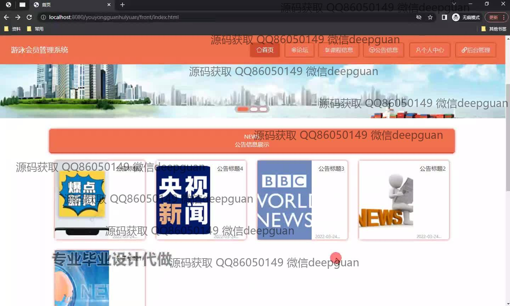
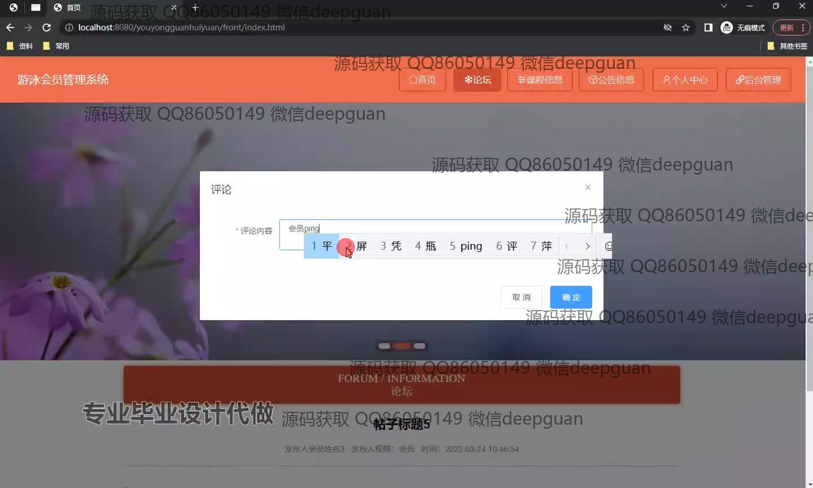
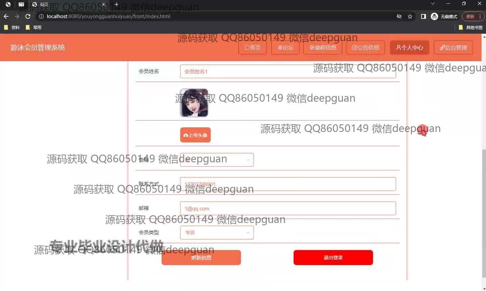
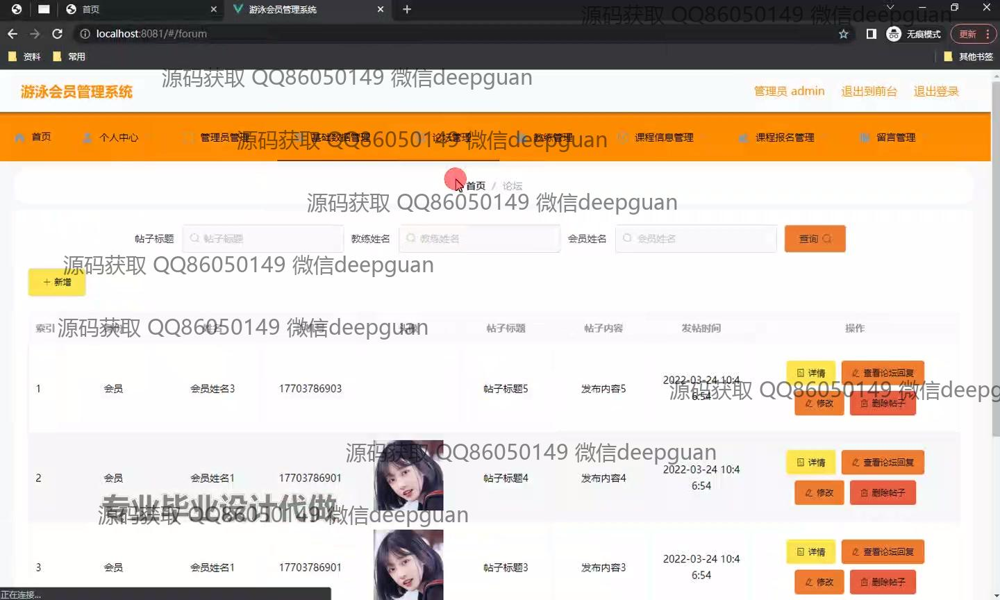
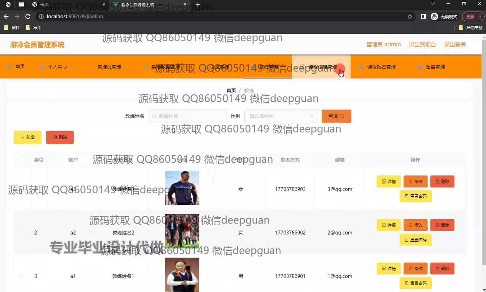
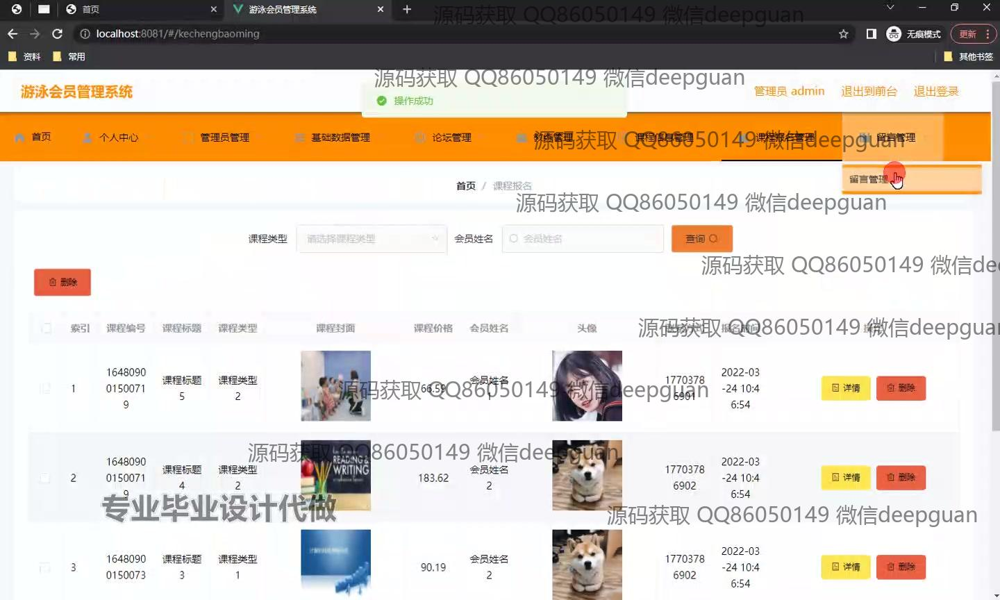
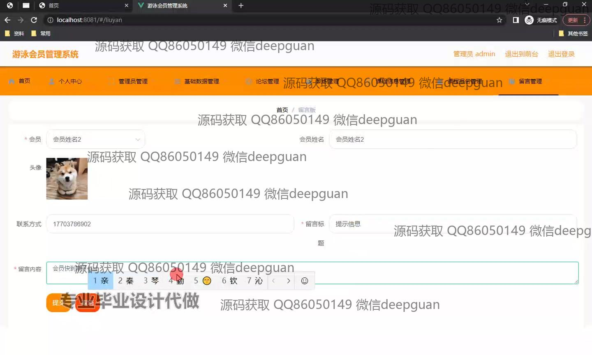
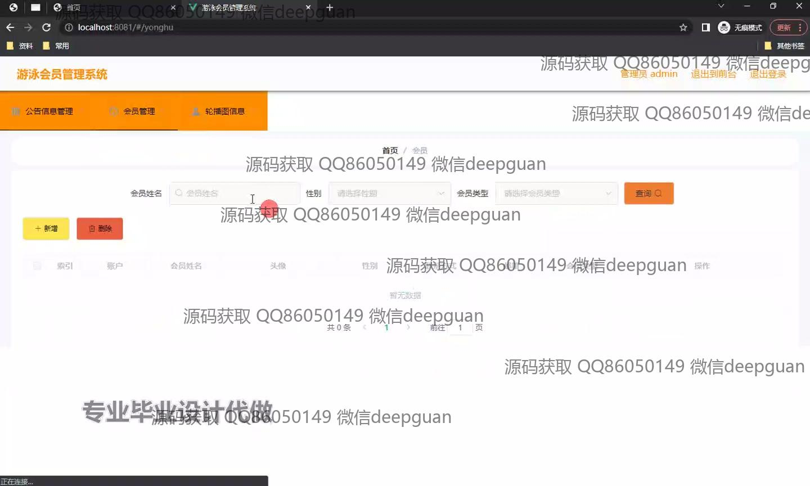
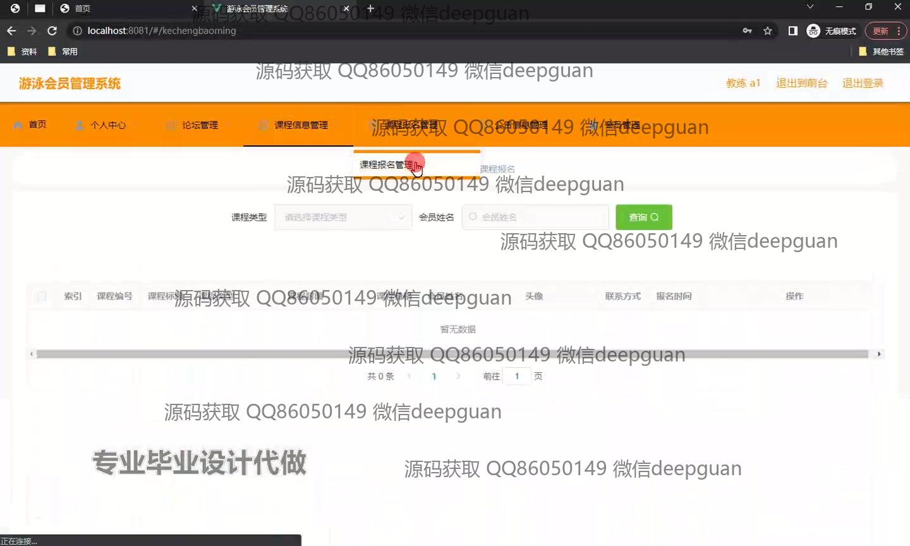
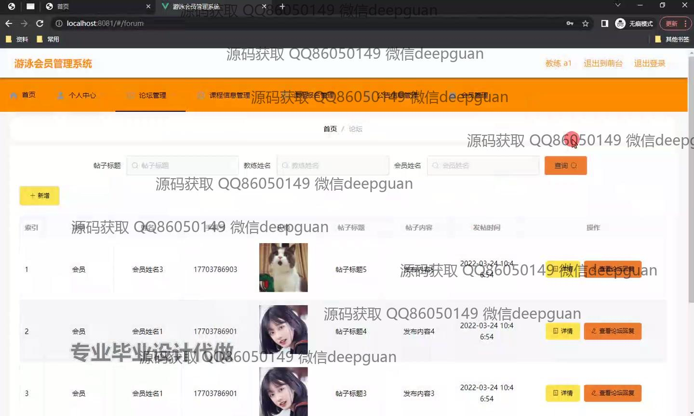
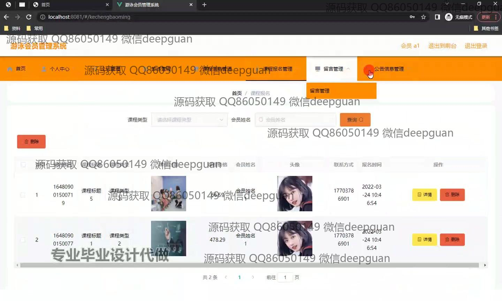
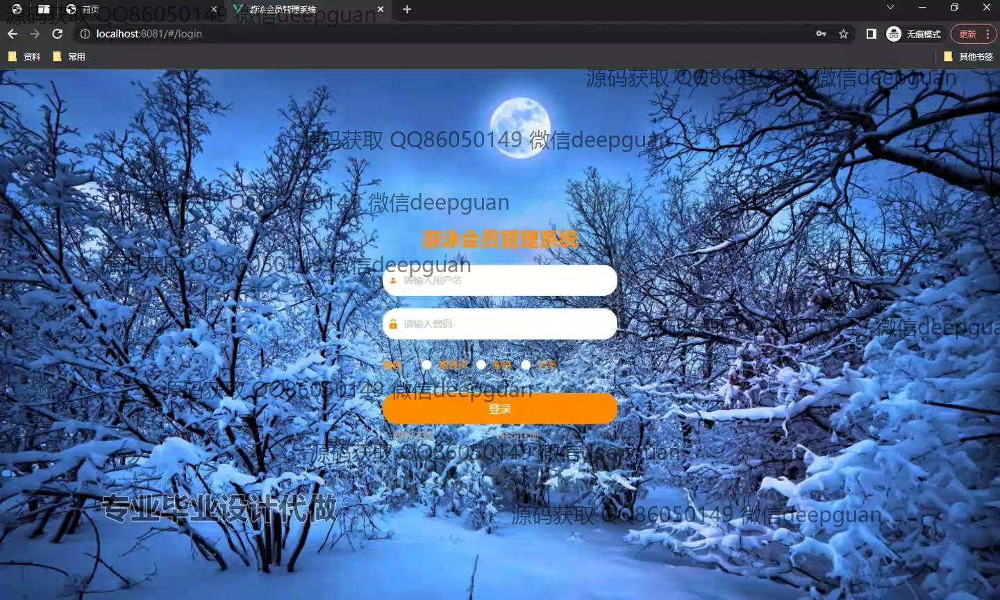

本代码来源于网络,仅供学习参考使用!

